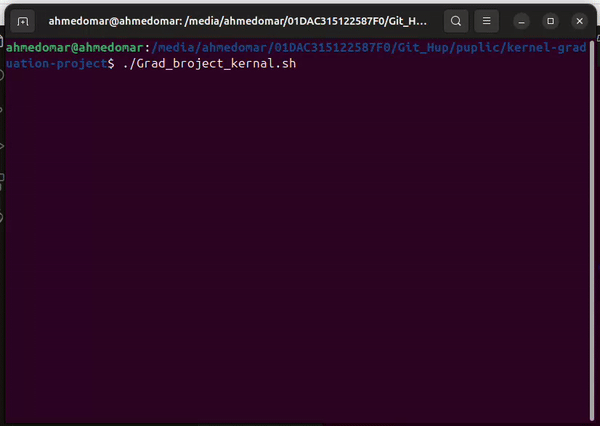

# Network Traffic Analysis

This project includes a shell script and a Python script designed to analyze network dump files captured by Wireshark. The scripts extract and summarize key information from the network traffic data.

## Overview

- **Shell Script**: Analyzes network traffic data from a Wireshark pcap file. It performs the following tasks:
  - Extracts and counts total packets.
  - Identifies the number of HTTP and HTTPS/TLS packets.
  - Extracts and identifies the top 5 source and destination IP addresses.

- **Python Script**: Uses hash maps to determine the top 5 source and destination IP addresses based on frequency. It processes the IP address lists generated by the shell script.

## Usage

1. **Set the pcap File Path**: Update the `pcap_file` variable in the shell script to point to your Wireshark pcap file.

2. **Run the Shell Script**:
   ```bash
   ./Grad_broject_kernal.sh
   This will generate a summary report, including:
   - Total Packets
   - Counts of HTTP and HTTPS/TLS packets
   - Top 5 Source IP Addresses
   - Top 5 Destination IP Addresses

3. **Python Script**:
   The Python script `Hashmap.py` is called by the shell script to process IP addresses. No additional setup is required for the Python script.

## Example Output

For an example of the output generated by the scripts, see the `demo.gif` file included in the project. This animated GIF demonstrates the analysis process and the resulting report.


## Files

- `Grad_broject_kernal.sh`: Shell script for analyzing network traffic.
- `Hashmap.py`: Python script for identifying top IP addresses.
- `demo.gif`: Demonstration of the analysis process (animated GIF).

## Acknowledgements

- This project uses `tshark` from Wireshark for network traffic analysis.
- Python's built-in data structures are used for efficient IP address frequency counting.

